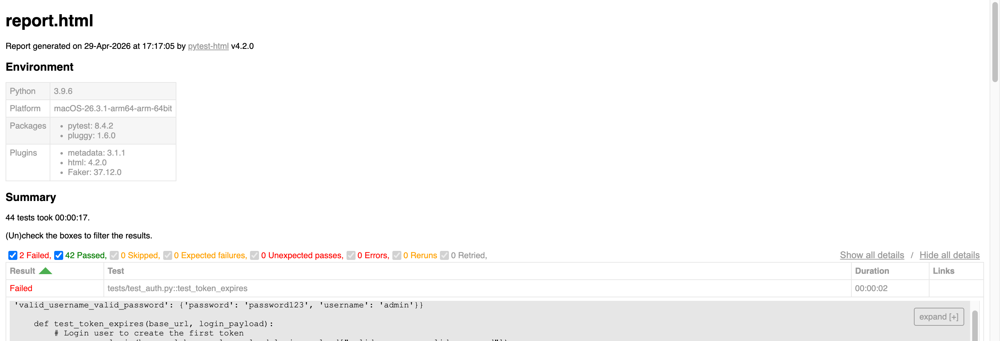

# Teachers API Automation Framework

A robust, modular, and professional API automation testing framework built using **Python** and **Pytest**. This framework validates a RESTful API for managing teacher records, covering CRUD (Create, Read, Update, Delete) operations, filtering, and authentication.

## 📊 Test Execution Report


_A professional HTML report generated after test execution, showing pass/fail status and detailed logs._

## 🚀 Key Features

- **End-to-End API Testing**: Comprehensive test coverage for all CRUD operations on teacher data.
- **Modular Architecture**: Clean separation between API methods (`api/`), test logic (`tests/`), and utility functions (`utils/`).
- **Dynamic Data Generation**: Integration with **Faker** for generating realistic test data (emails, names, phone numbers).
- **Session-Based Authentication**: Secure handling of JWT/auth tokens via Pytest fixtures for seamless test execution.
- **Detailed HTML Reporting**: Automatic generation of visual test reports with execution summaries.
- **Enhanced Logging**: Custom logging configuration for detailed tracking of request/response cycles.

## 🛠 Tech Stack

- **Language**: Python 3.x
- **Testing Framework**: [Pytest](https://pytest.org/)
- **API Communication**: [Requests](https://requests.readthedocs.io/)
- **Data Generation**: [Faker](https://faker.readthedocs.io/)
- **Reporting**: [Pytest-HTML](https://pytest-html.readthedocs.io/)
- **Environment Management**: [Python-dotenv](https://pypi.org/project/python-dotenv/)

## 📁 Project Structure

```text
├── api/                # API endpoint wrappers and request methods
├── tests/              # Test cases and conftest.py (fixtures)
├── utils/              # Helper functions (e.g., custom logger)
├── .env                # Environment variables (Sensitive info)
├── pytest.ini          # Global Pytest configuration
├── requirements.txt    # Project dependencies
├── report.html         # Generated test report
└── README.md           # Documentation
```

## ⚙️ Setup & Installation

### Prerequisites

- Python 3.8 or higher installed on your machine.

### Installation Steps

1. **Clone the Repository**

    ```bash
    git clone https://github.com/shifat97/teachers-api-automation-pytest.git
    cd teachers-api-automation-pytest
    ```

2. **Create and Activate a Virtual Environment**

    ```bash
    python -m venv venv
    source venv/bin/activate  # On Windows: venv\Scripts\activate
    ```

    or

    ```bash
    python3 -m venv venv
    source venv/bin/activate  # On Mac: venv\Scripts\activate
    ```

3. **Install Dependencies**

    ```bash
    pip install -r requirements.txt
    ```

    or

    ```bash
    pip3 install -r requirements.txt
    ```

4. **Environment Configuration**
   Create a `.env` file in the root directory and add the following variables:
    ```env
    BASE_URL=YOUR_URL
    PORT=PORT_NUMBER
    ADMIN_USERNAME=USERNAME
    ADMIN_PASSWORD=PASSWORD
    TEST_INVALID_TOKEN=YOUR_TEST_TOKEN_HERE
    LOG_LEVEL=PRODUCTION
    ```

## 🧪 Running Tests & Generating Reports

To execute all tests and generate a professional HTML report:

```bash
pytest --html=report.html --self-contained-html
```

To run a specific test file:

```bash
pytest tests/test_create_teacher.py
```

To run tests and see real-time log output:

```bash
pytest -s
```

---

_Developed by Md. Shifat Bin Reza._
